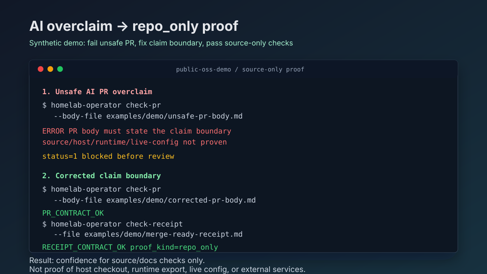

# Demo

This demo is a synthetic, source-only replay that shows the core Homelab
Operator move: stop an unsafe AI pull request overclaim, correct it to
`repo_only`, then pass the local contract checks.



All paths and outputs are public examples. They do not include private
hostnames, addresses, logs, runtime state, live config, secrets, or external
service proof. The image is a static share asset, not deployment or runtime
evidence.

## 2-Minute Replay

Run from the repository root after installing the development package. Use the
Python 3 executable available in your environment; on macOS this is often:

```bash
python3 -m pip install -e ".[dev]"
```

Then replay the demo:

```bash
set +e
homelab-operator check-pr --body-file examples/demo/unsafe-pr-body.md
unsafe_status=$?
set -e
printf 'unsafe_status=%s\n' "$unsafe_status"

homelab-operator check-pr --body-file examples/demo/corrected-pr-body.md
homelab-operator receipt-template --state MERGE_READY
homelab-operator check-receipt --file examples/demo/merge-ready-receipt.md
homelab-operator doctor --root .
```

What this proves:

- The unsafe pull request body is rejected before review because it claims more
  than the PR body substantiates.
- The corrected pull request body passes after it states `repo_only` proof and
  names what was not checked.
- The receipt and doctor checks stay inside source/documentation proof. They do
  not prove host checkout, runtime export, live config, external service status,
  or end-to-end operation.

## Expected Transcript

```text
$ set +e
$ homelab-operator check-pr --body-file examples/demo/unsafe-pr-body.md
ERROR PR body must state the source/host/runtime/live-config claim boundary

$ unsafe_status=$?
$ set -e
$ printf 'unsafe_status=%s\n' "$unsafe_status"
unsafe_status=1

$ homelab-operator check-pr --body-file examples/demo/corrected-pr-body.md
PR_CONTRACT_OK

$ homelab-operator receipt-template --state MERGE_READY
## Agent Lane Receipt

- Exit state: MERGE_READY
- Issue:
- Branch / worktree:
- PR:
- Owned paths:
- Surface classification:
- Proof kind:
- Claim proven:
- Claim not proven:
- Repo gate:
- Host/runtime handoff needed:
- Host gate needed:
- Runtime gate needed:
- Live config gate needed:
- Checks or commands run:
- Blockers:
- Next safe command:

$ homelab-operator check-receipt --file examples/demo/merge-ready-receipt.md
RECEIPT_CONTRACT_OK

$ homelab-operator doctor --root .
PR_CONTRACT_OK
RECEIPT_CONTRACT_OK
SURFACE_CLAIM_OK
ESTATE_CONTRACT_OK
PRIVACY_SCAN_OK
HOMELAB_OPERATOR_DOCTOR_OK
```

## Claim Boundary

The corrected example uses `repo_only` proof. It proves only that local source,
documentation, and contract checks are coherent. It does not prove host
checkout, runtime export, live config, external service status, or end-to-end
operation.
